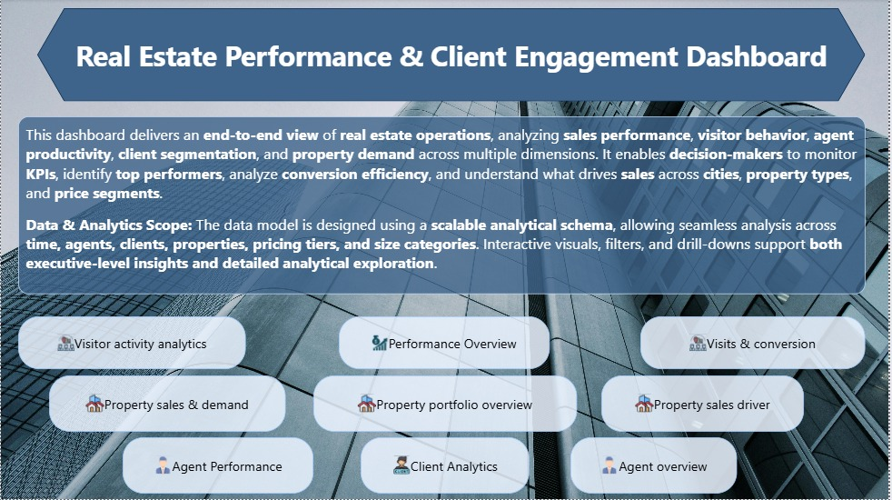
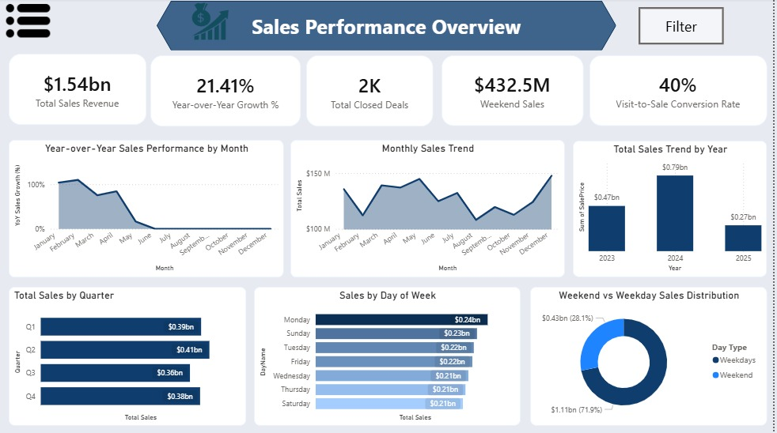
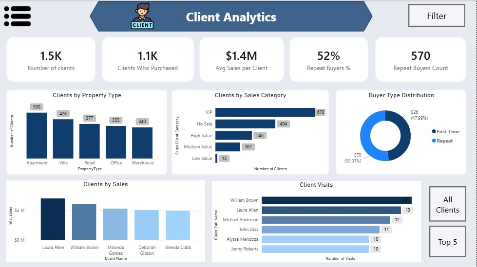
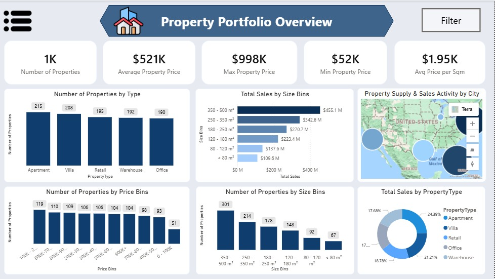

# 🏢 Real Estate Performance & Client Engagement Dashboard

🚀 Live Project | Power BI Dashboard | Business Intelligence Case Study

> An end-to-end **Power BI** analytics project analyzing real estate operations across sales performance, visitor behavior, agent productivity, client segmentation, and property demand across multiple dimensions.

---
## Dashboard Preview (Key Pages)






> 📌 Preview shows key dashboard pages. Full detailed walkthrough available below.

---
## 📊 Project Overview

This dashboard transforms raw real estate transactional data into actionable business intelligence. It covers **5 interconnected data domains** — Properties, Clients, Agents, Sales, and Visits — enabling data-driven decisions across the entire sales funnel.

| Dataset | Records |
|---|---|
| Properties | 1,000 |
| Clients | 1,500 |
| Agents | 100 |
| Sales Transactions | 2,000 |
| Property Visits | 5,000 |

---

## 🗂️ Dashboard Pages (10 Pages)

| # | Page | Focus |
|---|---|---|
| 1 | **Sales Performance Overview** | Executive KPIs, revenue trends, quarterly & daily breakdown |
| 2 | **Visits & Conversion** | Funnel analysis, monthly trends, weekday vs weekend visits |
| 3 | **Visitor Activity Analytics** | Visitor segmentation, price range interest, size & type impact |
| 4 | **Agent Overview** | Team-level productivity, map view, Top 5 by sales/visits/avg sale |
| 5 | **Agent Performance** | Individual rankings, closed deals, goal tracking |
| 6 | **Client Analytics** | Segmentation, loyalty, buyer type distribution, top clients |
| 7 | **Property Portfolio Overview** | Inventory breakdown by type, size, price bins + city map |
| 8 | **Property Sales & Demand** | Sales distribution by city, most visited & sold properties |
| 9 | **Property Sales Drivers** | Granular property-level table: size, city, sales count, revenue |
| 10 | **Navigation Home** | Central hub linking all 9 dashboard pages |

---

## 🔑 Top Insights

### 💰 1. Revenue & Growth
- **Total Sales Revenue:** $1.54 Billion across 2,000 closed deals
- **YoY Revenue Growth:** 21.41% — consistent upward trajectory
- **Strongest Quarter:** Q2 leads at $0.41B, pointing to a spring-driven demand cycle
- **Sales by Year:** $0.47B (2023) → $0.79B (2024) → $0.27B (2025 partial) — clear growth momentum
- **Average Property Price:** $521K | Price range: $52K – $998K

---

### 🔄 2. Visits & Conversion Funnel
- **40% Conversion Rate** — 2,000 purchases out of 5,000 visits, exceptionally strong for real estate
- **Visits YoY Growth: 56.84%** — demand is outpacing closed deals, signaling room to tighten the bottom of the funnel
- **Avg Visits per Customer: 3** — clients need multiple touchpoints before purchasing
- **Tuesday is the busiest visit day** (744 visits), Monday is the quietest (663)

> 💡 **Actionable:** Tuesday–Friday window is the highest-activity period for both visits and sales — concentrate agent availability and follow-ups in this window.

---

### 📅 3. Weekday vs. Weekend Pattern (Visits & Sales)
- **Sales:** 71.9% weekday ($1.11B) vs. 28.1% weekend ($432M)
- **Visits:** 70.62% weekday (3.53K) vs. 29.38% weekend (1.47K)
- The pattern is **consistent across both visits and sales** — weekdays dominate the entire pipeline

> 💡 **Actionable:** Weekend open-house campaigns could capture the untapped 29% visit pool and convert it at a higher rate.

---

### 👥 4. Visitor Segmentation
- **Occasional Visitor:** 628 clients — largest segment, visited but haven't committed
- **Frequent Visitor:** 562 clients — high-intent, needs a closing push
- **New Visitor:** 184 — healthy pipeline replenishment
- **Super Active Visitor:** 82 — VIP prospects requiring white-glove treatment
- **Largest visits by size:** 350–500 m² properties attract 1,509 visits — the sweet spot for buyer interest

> 💡 **Actionable:** A structured re-engagement campaign for the 628 Occasional Visitors is the single biggest conversion opportunity in the funnel.

---

### 🏆 5. Agent Performance
- **Top Performer: Samantha Vargas** — $24.22M, exceeding the $15M goal by **+61.44%**
- **Top 5 Agents** all exceeded $20M individually vs. a team avg sale of $769K per agent
- **Top by Avg Sale Price:** Carolyn Terry at $1.08M per deal — highest deal quality
- **Top by Visits:** Carolyn Gibbs & Julie Barrett at 66 visits each — most active in the field
- Interesting split: top by **volume** ≠ top by **avg sale** — two distinct performance profiles exist on the team

> 💡 **Actionable:** Pair high-volume agents (Carolyn Gibbs) with high-avg-sale agents (Carolyn Terry) for knowledge transfer on deal quality vs. quantity.

---

### 🤝 6. Client Loyalty & Segmentation
- **52% Repeat Buyer Rate** — 570 out of 1,096 purchasing clients transacted more than once
- **1,096 clients purchased** out of 1,500 total — 404 are still "No Sale" prospects
- **Client Segments:** VIP (670) | No Sale (404) | High Value (246) | Medium Value (167) | Low Value (13)
- **Top Client by Revenue: Laura Allen** — $7.0M | **Top Client by Visits: William Brown** — 14 visits
- **Apartments attract the most clients** (500), followed by Villas (428)

> 💡 **Actionable:** The 404 "No Sale" clients have already engaged — a targeted outreach here has zero acquisition cost and high conversion potential.

---

### 🏘️ 7. Property Portfolio & Inventory
| Property Type | Count | % of Total Sales |
|---|---|---|
| 🏢 Apartment | 215 | 24.39% |
| 🏖️ Villa | 208 | 21.21% |
| 🛍️ Retail | 195 | 18.78% |
| 🏭 Warehouse | 192 | 17.68% |
| 🏬 Office | 190 | ~17.94% |

- **Price per sqm is nearly uniform** across all types (~$1.95K/m²), meaning **size and location** drive value more than property type
- **Most inventory is in the 350–500 m² range** (301 properties) — perfectly aligned with highest visit and sales demand

---

### 📍 8. Property Sales & Demand by City
| City | Sales Share | Avg Price/sqm |
|---|---|---|
| 🗽 New York | 21.78% | $1.9K/m² |
| 🌴 Miami | 21.41% | $1.9K/m² |
| 🌆 Los Angeles | 19.33% | $2.0K/m² |
| 🤠 Houston | 19.14% | $1.9K/m² |
| 🌃 Chicago | 18.33% | $2.0K/m² |

- Revenue is **evenly distributed** — no single city is a risk concentration point
- **Chicago & LA have the highest avg price per sqm** ($2.0K) despite lower total sales share — premium markets with lower volume
- **Most expensive property:** Apartment - Miami approaching $1M
- **Most visited property:** Apartment - Chicago with 13 visits

---

### 🔍 9. Property Sales Drivers (Individual Level)
- **Top revenue property:** Villa - Miami (#424) — $6.85M total across 6 deals
- **Most deals on a single property:** 7 deals (Apartment-Chicago #954, Office-LA #19, Warehouse-NY #373 among others)
- **Highest avg sale per deal:** Office - Miami (#234) at $1.18M per transaction
- Properties in **Miami and Houston dominate** the top revenue performers list

> 💡 **Actionable:** Identify what makes Villa-Miami (#424) and Apartment-Miami (#567) top performers — pricing, agent assignment, or location — and replicate across similar inventory.

---

## 🛠️ Tools & Tech Stack

| Tool | Usage |
|---|---|
| **Power BI Desktop** | Data modeling, DAX measures, dashboard design |
| **Microsoft Excel** | Raw data source (.xlsx) |
| **DAX** | Custom KPIs, YoY calculations, conversion metrics, visitor categorization |
| **Power Query** | Data transformation and relationship building |
| **Map Visual (TomTom/OSM)** | Geographic distribution of agents, clients, and properties |

---

## 📁 Data Model

```
Properties ──┐
             ├──► Sales ◄──── Agents
Clients ─────┘
             └──► Visits ◄─── Agents
```

All five tables are connected via foreign keys (`PropertyID`, `ClientID`, `AgentID`), enabling cross-filtering across every dashboard page.

---

## 🚀 How to Use

1. Clone or download this repository
2. Open the `.pbix` file in **Power BI Desktop**
3. Update the data source path to point to your local `RealEstateAgencyData.xlsx` if needed
4. Refresh the data and explore the dashboard
5. Use the **Navigation Home page** to move between all 10 pages

---

## 📌 Key Business Takeaways

1. **Scale what works** — Q2 and weekdays are peak performance windows; align resources accordingly
2. **Fix the funnel bottom** — 56% visit growth with only 40% conversion means re-engagement campaigns have high ROI
3. **Two agent archetypes exist** — high-volume closers vs. high-value deal makers; both need different KPIs
4. **404 "No Sale" clients are low-hanging fruit** — they've already engaged, they just need the right follow-up
5. **Miami & Chicago are the hotspots** — highest-revenue properties concentrated there; prioritize inventory acquisition
6. **Size matters more than type** — 350–500 m² properties lead in both visits and sales regardless of property category

---

*Dashboard built as part of a Business Intelligence portfolio project.*

## 📄 Full Dashboard Walkthrough (All Pages)

For the complete dashboard including all pages, detailed visuals, and navigation flow:

👉 [View Full Dashboard](Real_Estate_Dashboard_Walkthrough.pdf)
